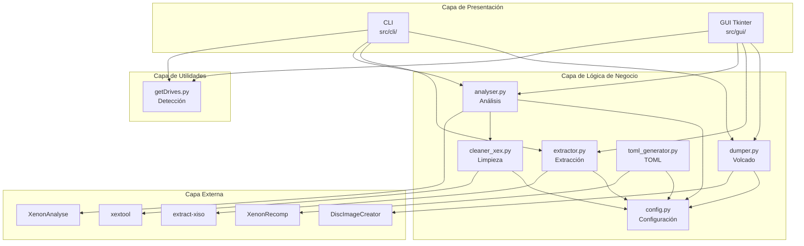

# 🏗️ Arquitectura del Sistema

## Visión General

MrMonkeyShopWare sigue una arquitectura **modular por capas**, separando la lógica principal (core) de las interfaces de usuario (CLI/GUI).

---

## 📊 Diagrama de Arquitectura



---

## 📁 Estructura de Directorios

```
src/
├── __init__.py
├── core/                    # Lógica principal
│   ├── __init__.py
│   ├── config.py           # Configuración y rutas
│   ├── dumper.py           # Volcado de discos
│   ├── extractor.py        # Extracción de ISOs
│   ├── analyser.py         # Análisis de XEX
│   ├── cleaner_xex.py      # Limpieza de XEX
│   └── toml_generator.py   # Generación de TOML
├── cli/                     # Interfaz CLI
│   ├── __init__.py
│   ├── main.py             # Punto de entrada
│   ├── dump.py             # Comando dump
│   ├── extract.py          # Comando extract
│   ├── analyse.py          # Comando analyse
│   └── tomlgen.py          # Comando tomlgen
├── gui/                     # Interfaz GUI
│   ├── __init__.py
│   └── main.py             # Aplicación Tkinter
└── utils/                   # Utilidades
    ├── __init__.py
    └── getDrives.py        # Detección de unidades
```

---

## 🔄 Patrones de Diseño

### 1. Módulos Independientes
Cada módulo del core es independiente y puede usarse por separado.

```python
from src.core import dump_disc, extract_iso, analyse_xex

# Uso individual
dump_disc("E:")
extract_iso("game.iso")
analyse_xex("default.xex")
```

### 2. Configuración Centralizada
Todas las rutas se gestionan desde `config.py` con soporte para variables de entorno.

### 3. Logging Opcional
Cada función acepta un parámetro `log` para inyectar logging personalizado.

```python
def dump_disc(drive, gui_ref=None, out_path=None):
    log = gui_ref.log if gui_ref else print
```

### 4. Manejo de Errores
Funciones retornan `True/False` o `None` en caso de error, permitiendo encadenar operaciones.

---

## 🔌 Puntos de Extensión

| Componente | Cómo Extender |
|------------|---------------|
| Nueva herramienta | Añadir ruta en `config.py`, crear módulo en `core/` |
| Nuevo comando CLI | Crear archivo en `cli/`, seguir patrón existente |
| Nueva funcionalidad GUI | Añadir botón/método en `gui/main.py` |
| Nueva utilidad | Añadir en `utils/`, exportar en `__init__.py` |

---

## 📦 Dependencias

### Internas
- `src.core` → Lógica principal
- `src.utils` → Utilidades compartidas

### Externas (Python)
- `subprocess` → Ejecución de herramientas
- `os`, `tempfile` → Gestión de archivos
- `tkinter` → GUI
- `argparse` → Parsing de CLI
- `psutil`, `pywin32` → Sistema Windows

### Externas (Binarios)
- DiscImageCreator, extract-xiso, xextool, XenonAnalyse, XenonRecomp
