# 🔄 Flujo de Datos

## Pipeline Completo

El flujo de datos desde un disco Xbox 360 hasta código recompilado sigue este proceso:

```mermaid
flowchart LR
    A[📀 Disco Xbox 360] --> B[dump_disc]
    B --> C[📁 game.iso]
    C --> D[extract_iso]
    D --> E[📂 Carpeta Extraída]
    E --> F[default.xex]
    F --> G[clean_xex]
    G --> H[default_clean.xex]
    H --> I[analyse_xex]
    I --> J[analysis.toml]
    J --> K[generate_toml]
    K --> L[project.toml]
    L --> M[XenonRecomp]
    M --> N[🖥️ Código C++]
```

---

## Etapas Detalladas

### 1. Dump de Disco

**Entrada**: Letra de unidad (ej: `E:`)  
**Salida**: Archivo ISO en `%TEMP%/x360dump/game.iso`

---

### 2. Extracción de ISO

```mermaid
sequenceDiagram
    participant U as Usuario
    participant E as extractor.py
    participant X as extract-xiso
    participant FS as Sistema de Archivos
    
    U->>E: extract_iso("game.iso")
    E->>E: Sanitizar rutas
    E->>FS: Crear carpeta destino
    E->>X: Ejecutar: -x game.iso
    X->>FS: Extraer archivos
    E->>U: Ruta de carpeta extraída
```

**Entrada**: Archivo ISO  
**Salida**: Carpeta con contenido extraído (incluyendo `.xex`)

---

### 3. Limpieza de XEX

**Entrada**: Archivo XEX (posiblemente encriptado/comprimido)  
**Salida**: Archivo XEX limpio (`*_clean.xex`)

---

### 4. Análisis de XEX

```mermaid
sequenceDiagram
    participant U as Usuario
    participant A as analyser.py
    participant XA as XenonAnalyse
    participant FS as Sistema de Archivos
    
    U->>A: analyse_xex("default.xex")
    A->>A: Limpiar XEX si necesario
    A->>XA: Ejecutar análisis
    XA->>FS: Escribir analysis.toml
    A->>A: Convertir TOML → JSON
    A->>FS: Escribir analysis.json
    A->>U: (json_file, toml_file)
```

**Entrada**: Archivo XEX limpio  
**Salida**: `analysis.toml` y `analysis.json`

---

### 5. Generación de TOML

```mermaid
sequenceDiagram
    participant U as Usuario
    participant T as toml_generator.py
    participant XR as XenonRecomp
    
    U->>T: generate_project_toml(xex, json)
    T->>T: Construir estructura TOML
    T->>T: Escribir project.toml
    T->>XR: Validar TOML
    XR->>T: Resultado validación
    T->>U: Ruta al project.toml
```

**Entrada**: XEX + analysis.json  
**Salida**: `project.toml` listo para XenonRecomp

---

## Archivos Temporales

| Etapa | Ubicación | Archivo |
|-------|-----------|---------|
| Dump | `%TEMP%/x360dump/` | `game.iso` |
| Extracción | Junto al ISO | `game/` (carpeta) |
| Limpieza | `%TEMP%/x360dump/analysis/` | `*_clean.xex` |
| Análisis | `%TEMP%/x360dump/analysis/` | `analysis.toml`, `analysis.json` |

---

## Manejo de Errores

```mermaid
flowchart TD
    A[Operación] --> B{¿Éxito?}
    B -->|Sí| C[Retornar resultado]
    B -->|No| D[Log error]
    D --> E[Limpiar temporales]
    E --> F[Retornar None/False]
```

Cada módulo:
1. Valida entradas antes de procesar
2. Captura excepciones de subprocesos
3. Limpia archivos temporales en caso de error
4. Retorna `None` o `False` para indicar fallo
