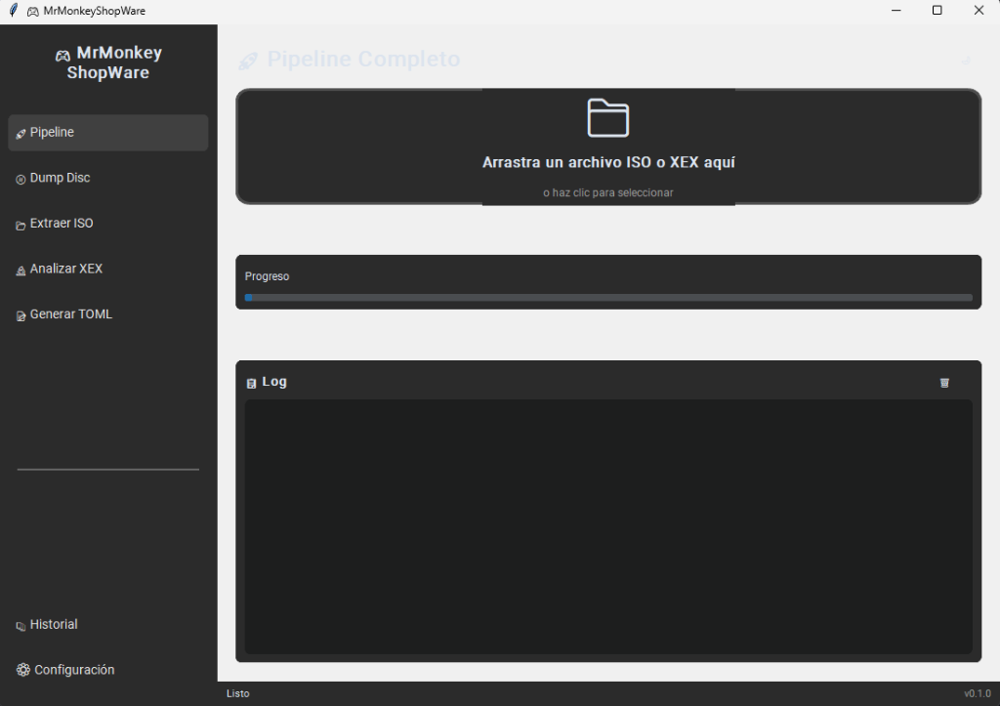
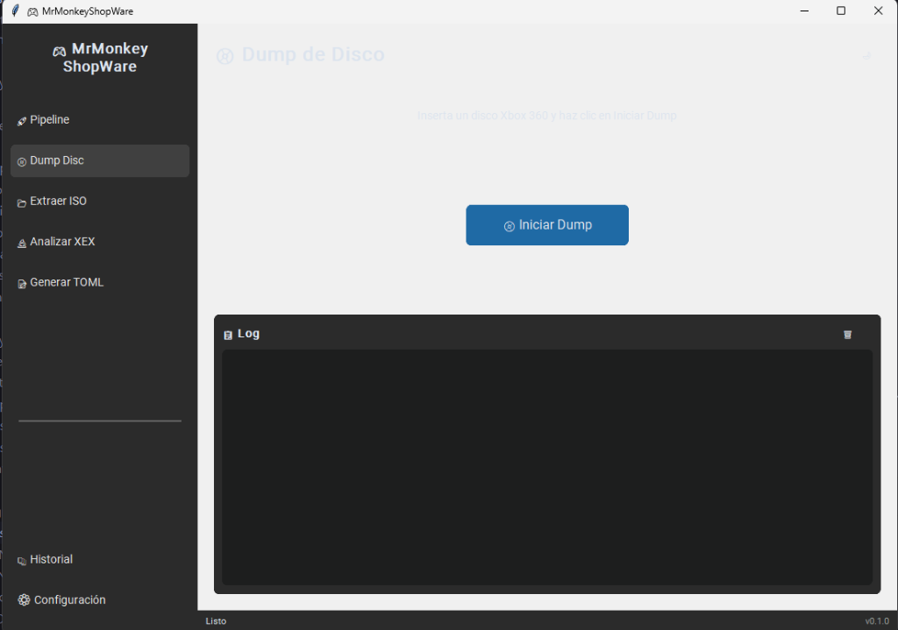
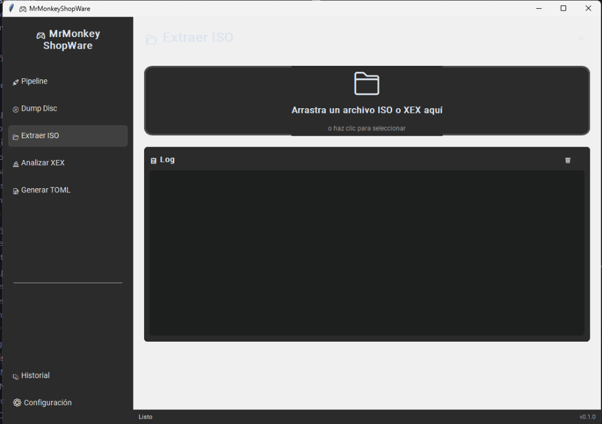
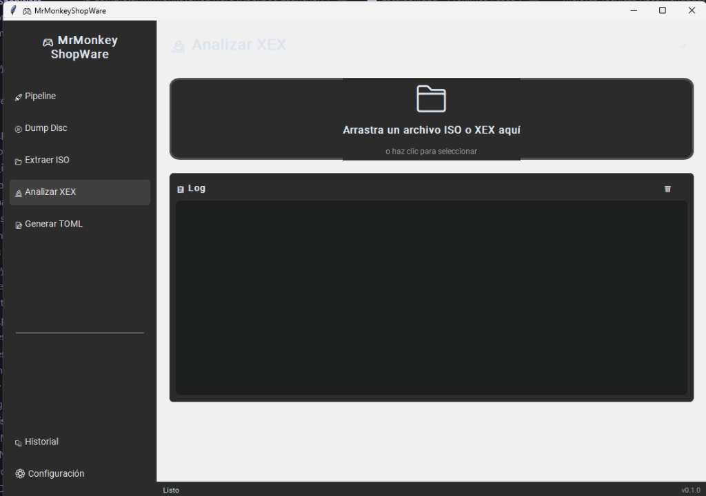
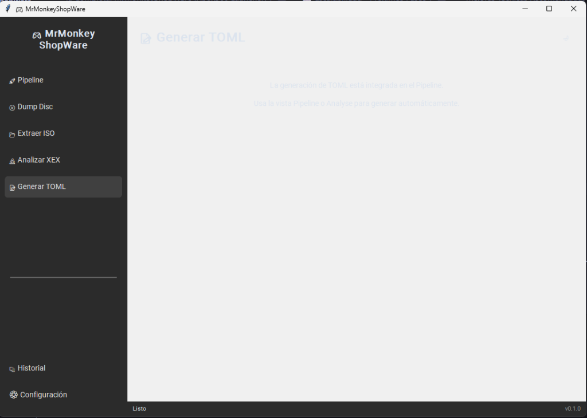
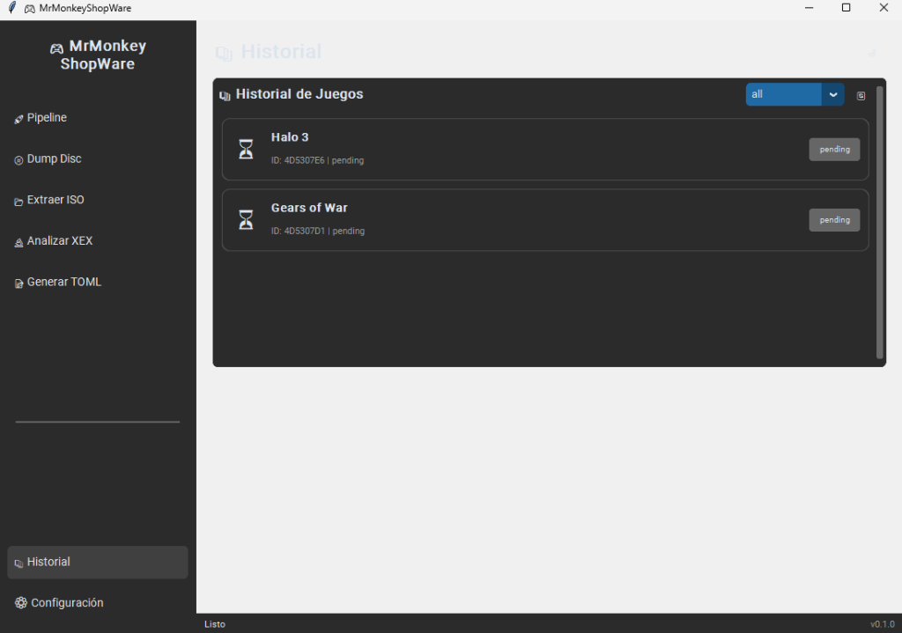
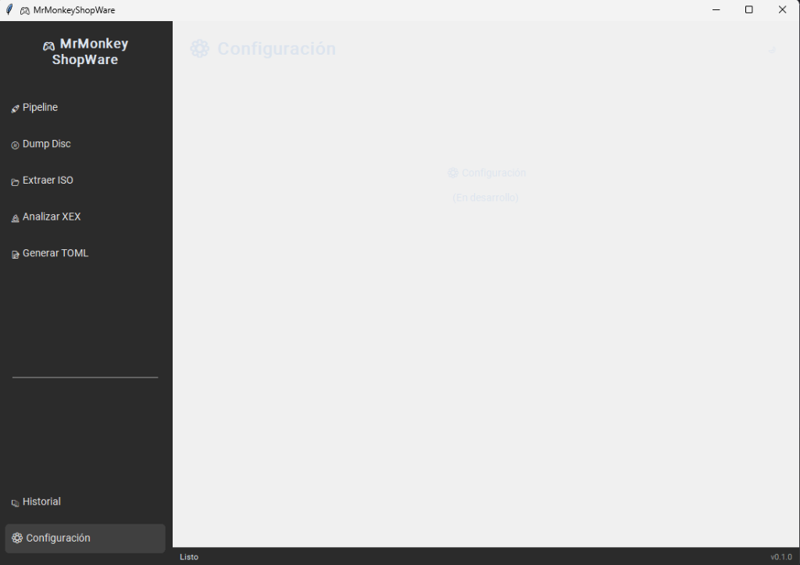

# 🖼️ Catálogo de Vistas - GUI MrMonkeyShopWare

Documentación visual de todas las vistas de la interfaz gráfica.

---

## 📋 Índice de Vistas

| Vista | Descripción | Componentes |
|-------|-------------|-------------|
| [Pipeline](#-pipeline) | Vista principal con drop zone | DropZone, ProgressBar, LogView |
| [Dump](#-dump) | Volcado de disco | Botón, LogView |
| [Extract](#-extract) | Extracción de ISO | DropZone (.iso), LogView |
| [Analyse](#-analyse) | Análisis de XEX | DropZone (.xex), LogView |
| [Historial](#-historial) | Lista de juegos | GameList, GameCards |
| [Configuración](#-configuración) | Ajustes | (En desarrollo) |

---

## 🚀 Pipeline

**Ruta**: Sidebar → Pipeline

**Descripción**: Vista principal que permite arrastrar un archivo ISO o XEX para ejecutar el pipeline completo automáticamente.

**Componentes**:
- `DropZone` - Zona de arrastrar y soltar
- `ProgressBar` - Barra de progreso
- `LogView` - Área de logs con timestamps

---

## 📀 Dump

**Ruta**: Sidebar → Dump Disc

**Descripción**: Permite realizar el volcado de un disco Xbox 360 desde una unidad óptica.

**Componentes**:
- Botón "Iniciar Dump"
- Diálogo de entrada para letra de unidad
- `LogView` - Logs del proceso

---

## 📂 Extract

**Ruta**: Sidebar → Extraer ISO

**Descripción**: Extrae el contenido de un archivo ISO de Xbox 360.

**Componentes**:
- `DropZone` - Solo acepta archivos .iso
- `LogView` - Logs de extracción

---

## 🔬 Analyse

**Ruta**: Sidebar → Analizar XEX

**Descripción**: Analiza un archivo XEX y genera los archivos de análisis.

**Componentes**:
- `DropZone` - Solo acepta archivos .xex
- `LogView` - Logs de análisis

---

## 📝 Generar TOML

**Ruta**: Sidebar → Generar TOML

**Descripción**: Vista informativa que indica que la generación de TOML está integrada en el Pipeline.

**Componentes**:
- Texto informativo
- Redirige a Pipeline o Analyse

---

## 📚 Historial

**Ruta**: Sidebar → Historial

**Descripción**: Muestra la lista de juegos procesados guardados en la base de datos.

**Componentes**:
- `GameList` - Lista scrolleable
- `GameCard` - Tarjetas individuales con:
  - Icono de status
  - Nombre del juego
  - Title ID
  - Badge de estado
- Filtro por status
- Botón refresh

---

## ⚙️ Configuración

**Ruta**: Sidebar → Configuración

**Descripción**: Panel de configuración con pestañas scrollables.

**Componentes**:
- `TabView` con 4 pestañas:
  - 🔧 Herramientas (rutas a ejecutables)
  - 🎨 Apariencia (tema)
  - 💾 Base de Datos (ruta, backup)
  - 📜 Logs (nivel, archivo)
- Botón "Guardar Configuración"
- Scroll en pestaña de herramientas

---

## 🎮 Detalle de Juego 🆕

**Ruta**: Historial → Click en juego

**Descripción**: Vista de detalle con toda la información de un juego procesado.

**Componentes**:
- `TabView` con 3 pestañas:
  - 📋 Info: Metadata de XexTool
  - 📁 Archivos: Rutas a XEX, TOML, JSON
  - 📝 Notas: Área de texto para documentar el port
- Selector de estado
- Botón eliminar
- Botón volver

**Metadata mostrada**:
- Title ID, Media ID
- Versión, Disco X de Y
- Regiones, Rating ESRB
- Entry Point, PE Original
- Librerías estáticas

---

## 🎨 Elementos Comunes

### Sidebar
- Logo/Título: "🎮 MrMonkey ShopWare"
- Botones de navegación con estados hover/activo
- Separador visual
- Botones inferiores (Historial, Config)

### Barra de Estado
- Mensaje de status actual
- Versión de la app

### Toggle de Tema
- Botón 🌙 (dark) / ☀️ (light)
- Ubicado en esquina superior derecha

---

## 📝 Notas
- Las capturas se irán añadiendo a medida que se valide cada vista
- Formato recomendado para capturas: PNG
- Resolución recomendada: 1100x750 (tamaño por defecto de la ventana)
