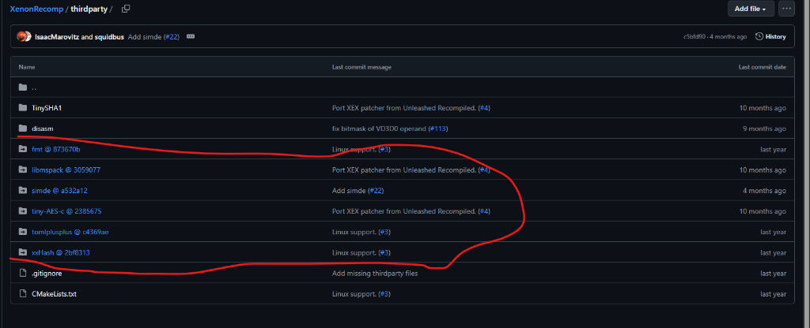
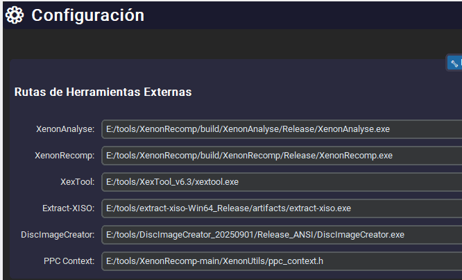

# 🔧 Guía de Solución de Problemas

Esta guía documenta los errores más comunes y sus soluciones, basada en casos reales de la comunidad.

---

## 📋 Índice de Errores

| Error | Categoría | Ir a solución |
|-------|-----------|---------------|
| ClangCL no encontrado | CMake/Compilación | [Ver](#error-clangcl-no-encontrado) |
| Submódulos vacíos | Git | [Ver](#error-submódulos-de-git-vacíos) |
| Configuración no persiste | GUI | [Ver](#error-configuración-no-se-guarda) |
| CMake no reconocido | Instalación | [Ver](#error-cmake-no-reconocido) |
| XenonAnalyse no encontrado | Rutas | [Ver](#error-xenonanalyse-no-encontrado) |

---

## Error: ClangCL no encontrado

### Síntoma

Al configurar un proyecto con CMake aparece:

```
error MSB8020: No se pueden encontrar las herramientas de compilación 
para ClangCL (Conjunto de herramientas de la plataforma = 'ClangCL').
```


### Causa

Visual Studio 2022 no tiene instalado el compilador Clang, que es requerido por algunos proyectos como XenonRecomp.

### Solución

1. Abre **Visual Studio Installer**
2. Busca tu instalación y haz clic en **"Modificar"**
3. Ve a **"Componentes individuales"**
4. Busca y marca:
   - ✅ C++ Clang Compiler for Windows
   - ✅ C++ Clang-cl for v143 build tools
   - ✅ MSBuild support for LLVM (clang-cl) toolset
5. Haz clic en **"Modificar"** y espera

Después borra la carpeta `build` y reconfigura:

```powershell
Remove-Item -Recurse -Force build
mkdir build
cd build
cmake .. -G "Visual Studio 17 2022" -T ClangCL -A x64
```

---

## Error: Submódulos de Git vacíos

### Síntoma

Al configurar con CMake aparece:

```
CMake Error at thirdparty/CMakeLists.txt:4 (add_subdirectory):
  The source directory
    E:/tools/XenonRecomp-main/thirdparty/fmt
  does not contain a CMakeLists.txt file.
```

### Causa

Descargaste el repositorio como **ZIP desde GitHub** en lugar de clonarlo con Git. Cuando descargas ZIP, los submódulos (carpetas con `@` en GitHub) vienen vacíos.



### Solución

**Opción A: Clonar correctamente (recomendado)**

```powershell
# Borrar la carpeta actual
Remove-Item -Recurse -Force "E:\tools\XenonRecomp-main"

# Clonar correctamente CON submódulos
git clone --recursive https://github.com/hedge-dev/XenonRecomp.git
```

**Opción B: Si ya clonaste sin --recursive**

```powershell
cd E:\tools\XenonRecomp
git submodule update --init --recursive
```

> [!IMPORTANT]
> Si aparece `fatal: not a git repository`, significa que descargaste ZIP. Debes usar la Opción A.

---

## Error: Configuración no se guarda

### Síntoma

Guardas configuraciones en la GUI (rutas de herramientas), pero al ejecutar operaciones el programa sigue usando las rutas antiguas.



### Causa

El archivo `settings.json` se guarda correctamente, pero el programa no lo recarga después de guardar.

### Solución (para usuarios)

1. Guarda la configuración en la GUI
2. **Reinicia la aplicación** para que cargue las nuevas rutas

### Solución (para desarrolladores)

Asegúrate de que `core/config.py` lea de `settings.json`:

```python
def _load_settings_value(key: str, default: str) -> str:
    # 1. Intentar leer de settings.json
    settings_path = Path.home() / ".mrmonkeyshopware" / "settings.json"
    if settings_path.exists():
        with open(settings_path, "r", encoding="utf-8") as f:
            settings = json.load(f)
            tools = settings.get("tools", {})
            if key in tools and tools[key]:
                return tools[key]
    
    # 2. Variable de entorno
    # 3. Valor por defecto
    return default
```

---

## Error: CMake no reconocido

### Síntoma

```
cmake : The term 'cmake' is not recognized as the name of a cmdlet
```

### Causa

CMake no está instalado o no está en el PATH del sistema.

### Solución

1. Descarga CMake desde [cmake.org/download](https://cmake.org/download/)
2. Durante la instalación, selecciona **"Add CMake to the system PATH"**
3. Reinicia PowerShell/CMD

Para verificar:
```powershell
cmake --version
```

---

## Error: XenonAnalyse no encontrado

### Síntoma

```
Error: No se encontró XenonAnalyse en 'C:\tools\...\XenonAnalyse.exe'. 
Ajusta core/config.py o define la variable de entorno XENON_ANALYSE_PATH.
```

### Causa

La ruta configurada para XenonAnalyse no es correcta o la herramienta no está compilada.

### Solución

1. **Compila XenonRecomp** siguiendo la [Guía de CMake](../tutoriales/guia-cmake.md)

2. **Configura la ruta** en la GUI:
   - Ve a ⚙️ Configuración
   - En "Rutas de Herramientas Externas", busca XenonAnalyse
   - Ingresa la ruta correcta (ej: `E:/tools/XenonRecomp/build/Release/XenonAnalyse.exe`)
   - Guarda y reinicia la aplicación

3. **O define variable de entorno**:
   ```powershell
   $env:XENON_ANALYSE_PATH = "E:\tools\XenonRecomp\build\Release\XenonAnalyse.exe"
   ```

---

## 📁 Ubicación del archivo settings.json

La configuración de MrMonkeyShopWare se guarda en:

```
%USERPROFILE%\.mrmonkeyshopware\settings.json
```

Por ejemplo: `C:\Users\TuUsuario\.mrmonkeyshopware\settings.json`

Puedes editarlo manualmente si lo necesitas:

```json
{
  "tools": {
    "XENON_ANALYSE_PATH": "E:/tools/XenonRecomp/build/Release/XenonAnalyse.exe",
    "XENON_RECOMP_PATH": "E:/tools/XenonRecomp/build/Release/XenonRecomp.exe",
    "XEXTOOL_PATH": "E:/tools/XexTool/xextool.exe",
    "EXTRACT_XISO_PATH": "E:/tools/extract-xiso/extract-xiso.exe",
    "DISC_IMAGE_CREATOR_PATH": "E:/tools/DiscImageCreator/DiscImageCreator.exe",
    "PPC_CONTEXT_PATH": "E:/tools/XenonRecomp/XenonUtils/ppc_context.h"
  }
}
```

---

## 🆘 ¿Problema no listado?

1. Revisa los [logs](../operaciones/logs.md) de la aplicación
2. Abre un [Issue en GitHub](https://github.com/MrMonkey/MrMonkeyShopWare/issues/new) con:
   - Descripción del error
   - Capturas de pantalla
   - Logs relevantes
   - Versión de Windows y Visual Studio

---

## 📸 Carpeta de Capturas

Las capturas de pantalla referenciadas en esta guía están en:

```
docs/capturas/
├── error-clangcl.png
├── submodulos-github.png
├── configuracion-gui.png
└── ...
```

Para agregar nuevas capturas:
1. Guarda la imagen en `docs/capturas/`
2. Referencia con: ``

---

<div align="center">

**¿Esta guía te ayudó? ⭐ Dale star al repo!**

</div>
