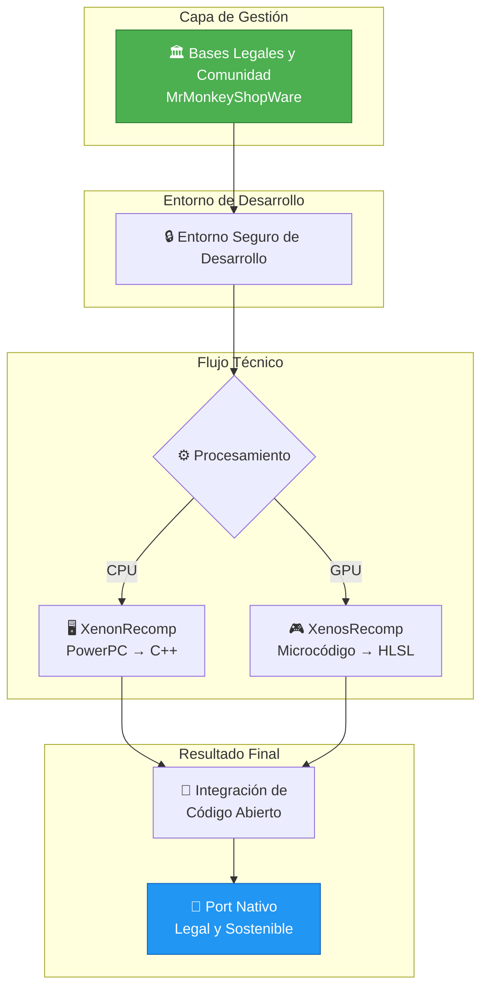

# 📚 Guía Maestra: Recompilación Estática de Xbox 360 a PC Nativo

> **Documento de Análisis Técnico**  
> Este documento analiza el proceso de transformación de un binario de consola (arquitectura PowerPC) en un ejecutable nativo de PC (arquitectura x86_64) utilizando técnicas de recompilación estática, basándose en el ecosistema de herramientas **XenonRecomp** y **XenosRecomp**.

---

## 📑 Tabla de Contenidos

1. [Ensayo: El Cambio de Paradigma en la Preservación](#1-ensayo-el-cambio-de-paradigma-en-la-preservación)
2. [La Revolución Visual: XenosRecomp (GPU)](#2-la-revolución-visual-xenosrecomp-gpu)
3. [Estudio de Caso: UnleashedRecomp](#3-estudio-de-caso-unleashedrecomp-sonic-unleashed-pc)
4. [Análisis de Integración: MrMonkeyShopWare](#4-análisis-de-integración-mrmonkeyshopware-vs-estándares-actuales)
5. [Diagrama de Arquitectura Unificado](#5-diagrama-de-arquitectura-unificado)
6. [Tutorial: Configuración y Recompilación](#6-tutorial-configuración-y-recompilación)
7. [Referencias y Recursos de Estudio](#7-referencias-y-recursos-de-estudio)
8. [Conclusión Final del Estudio](#8-conclusión-final-del-estudio)

---

## 1. Ensayo: El Cambio de Paradigma en la Preservación

### Introducción

Durante décadas, la única forma de jugar títulos de consolas antiguas en PC era la **emulación**. Los emuladores actúan como intérpretes en tiempo real, traduciendo cada instrucción del procesador original sobre la marcha. Esto consume una cantidad inmensa de recursos y suele presentar errores de precisión.

> [!IMPORTANT]
> **La recompilación estática rompe este esquema.** En lugar de interpretar el juego mientras se ejecuta, lo traducimos *antes* de jugar. El resultado no es un juego corriendo "dentro" de un emulador, sino un **programa nativo de Windows o Linux** que utiliza el 100% del potencial del hardware moderno.

### El Corazón Tecnológico: XenonRecomp

La arquitectura de la Xbox 360 (Xenon) es compleja: tres núcleos PowerPC de 3.2 GHz con capacidades vectoriales (VMX). El proceso de llevar esto a PC nativo se divide en **tres etapas críticas**:

| Etapa | Descripción |
|:------|:------------|
| **🔍 Análisis de Flujo** (`XenonAnalyse`) | Identifica las "Jump Tables" (tablas de salto) para mapear el flujo del código |
| **🔄 Traducción de Arquitectura** | Convierte el ensamblador PowerPC a C++, resolviendo el problema del Endianness mediante macros de intercambio de bytes |
| **🎮 Capa de Abstracción** (HLE) | Intercepta las llamadas al sistema (XDK) y las redirige a APIs modernas |

---

## 2. La Revolución Visual: XenosRecomp (GPU)

Uno de los mayores desafíos de la Xbox 360 es su GPU, llamada **Xenos**. Fue una de las primeras arquitecturas de shaders unificados, pero utilizaba un microcódigo de bajo nivel que los PCs modernos no entienden directamente. Aquí es donde entra **XenosRecomp**.

### ¿Cómo funciona la recompilación de GPU?

> [!NOTE]
> A diferencia de un emulador que traduce los shaders cada vez que el juego intenta dibujar algo (causando los famosos *shader stutters*), XenosRecomp realiza una **traducción estática**.

```
┌─────────────────────────────────────────────────────────────────┐
│                    Proceso de Recompilación GPU                  │
├─────────────────────────────────────────────────────────────────┤
│  Microcódigo Xbox 360  ──▶  Análisis  ──▶  HLSL (DX12/Vulkan)   │
└─────────────────────────────────────────────────────────────────┘
```

#### Pasos de la traducción:

1. **Microcódigo a HLSL**  
   Toma las instrucciones binarias de los shaders originales y las traduce a **HLSL** (High-Level Shader Language) compatible con DirectX 12 o Vulkan

2. **Mapeo de Registros**  
   Crea una "tabla de traducción" para que la tarjeta de video del PC sepa qué dato va en qué posición de la memoria de video

3. **Vertex Fetch Constant**  
   Emula este comportamiento usando `ByteAddressBuffers` en HLSL, permitiendo una precisión de imagen **1:1**

---

## 3. Estudio de Caso: UnleashedRecomp (Sonic Unleashed PC)

> [!TIP]
> **UnleashedRecomp** es el ejemplo más avanzado de esta tecnología. No es solo una traducción del código, es una **modernización integral** del motor *Hedgehog Engine*.

### 🚀 Innovaciones Técnicas del Proyecto

| Innovación | Descripción |
|:-----------|:------------|
| **Renderizador Multihilo** | Traduce llamadas de dibujo originales a APIs modernas (DX12/Vulkan) usando múltiples hilos de CPU |
| **Resolución del "FPS Glitch"** | Parcheado manual de variables de tiempo para permitir 60+ FPS sin romper la física (Havok) |
| **Parallel Transfer Queues** | Aprovecha el bus PCIe para carga de assets ultrarrápida |

---

## 4. Análisis de Integración: MrMonkeyShopWare vs. Estándares Actuales

Al comparar el repositorio **MrMonkeyShopWare** con el estado del arte (XenonRecomp/UnleashedRecomp), se observa una **sinergia clave** en la capa de gestión.

### 📊 Comparativa Estratégica

| Característica | Estándar XenonRecomp / Unleashed | Propuesta MrMonkeyShopWare |
|:---------------|:---------------------------------|:---------------------------|
| **Núcleo Técnico** | Alta complejidad en traducción PowerPC → C++ | Enfoque en la estructura de soporte y despliegue |
| **Legalidad** | Basada en la no distribución de activos (Clean Room) | ✅ **Fortaleza:** Documentación explícita de bases legales para la comunidad |
| **Gestión de Comunidad** | Desarrollo centralizado por grupos específicos (Hedge-dev) | ✅ **Diferencial:** Creación de un estándar de gestión para comunidades de código abierto |
| **Distribución** | Manual (compilación por parte del usuario) | 🎯 **Potencial:** Actuar como un gestor o "ShopWare" para facilitar el acceso legal |

### 📈 Avance del Proyecto ShopWare

> [!IMPORTANT]
> Tu documentación en `docs/index.md` establece una base sólida que la mayoría de los proyectos de recompilación ignoran: **la ética y la legalidad del código abierto**.

Mientras que UnleashedRecomp es una proeza técnica, **MrMonkeyShopWare** tiene el potencial de convertirse en el *"Sistema Operativo de Gestión"* que permita a otros desarrolladores usar las herramientas de XenonRecomp sin miedo a represalias legales, organizando a la comunidad bajo licencias claras y procesos de contribución definidos.

---

## 5. Diagrama de Arquitectura Unificado



---

## 6. Tutorial: Configuración y Recompilación

### Paso 1: Preparación de Herramientas

Clona los repositorios necesarios con sus submódulos:

```bash
# Clonar XenonRecomp (núcleo CPU)
git clone https://github.com/hedge-dev/XenonRecomp.git --recursive

# Clonar XenosRecomp (núcleo GPU)
git clone https://github.com/hedge-dev/XenosRecomp.git --recursive
```

### Paso 2: Análisis y Recompilación

#### 🎨 Recompilación de Shaders (GPU)

```bash
python xenos_recomp.py --input shader_binaries/ --output generated_shaders/ --api d3d12
```

#### 🖥️ Análisis de Código (CPU)

```bash
python tools/XenonAnalyse.py --input default.xex --output analysis_data.json
```

> [!WARNING]
> Asegúrate de tener Python 3.11+ instalado y todas las dependencias configuradas antes de ejecutar estos comandos.

### Paso 3: Compilación Final

Genera el proyecto CMake uniendo el código C++ traducido con los shaders HLSL:

```bash
# Configurar el proyecto
cmake -B build -DCMAKE_BUILD_TYPE=Release

# Compilar
cmake --build build --config Release
```

> [!TIP]
> Asegúrate de tener CMake 3.21+ y un compilador compatible (MSVC, Clang o GCC) instalados.

---

## 7. Referencias y Recursos de Estudio

| Recurso | Descripción | Enlace |
|:--------|:------------|:-------|
| **XenonRecomp** | Núcleo de recompilación CPU (PowerPC → C++) | [GitHub](https://github.com/hedge-dev/XenonRecomp) |
| **XenosRecomp** | Núcleo de recompilación GPU (Microcódigo → HLSL) | [GitHub](https://github.com/hedge-dev/XenosRecomp) |
| **MrMonkeyShopWare** | Gestión legal y comunitaria | [GitHub](https://github.com/MrMonkey09/MrMonkeyShopWare) |

---

## 8. Conclusión Final del Estudio

> [!TIP]
> **Posicionamiento Estratégico**

El proyecto **MrMonkeyShopWare** se posiciona como el **complemento administrativo y legal necesario** para la tecnología de XenonRecomp.

### 🎯 Recomendación para el Siguiente Paso

La recomendación es **integrar los lineamientos legales** de este repositorio directamente en el flujo de trabajo de los desarrolladores, creando una:

```
┌─────────────────────────────────────────────────────────────────┐
│           📋 "Plantilla de Proyecto Legal"                       │
│                                                                   │
│   Que acompañe a la herramienta de recompilación técnica,       │
│   facilitando el desarrollo legal y sostenible de ports.         │
└─────────────────────────────────────────────────────────────────┘
```

---

<div align="center">

**📝 Documento creado para el proyecto MrMonkeyShopWare**

*Estudio técnico sobre recompilación estática de Xbox 360 a PC*

</div>
