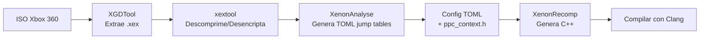

# Investigación: XenonRecomp y Unleashed Recompiled

## Resumen Ejecutivo

Esta investigación recopila información técnica sobre **XenonRecomp** y **Unleashed Recompiled**, proyectos de recompilación estática que convierten juegos de Xbox 360 a ejecutables nativos de PC.

---

## XenonRecomp

### ¿Qué es?
Herramienta que convierte ejecutables de Xbox 360 (archivos XEX) a código C++, permitiendo recompilarlos para cualquier plataforma.

**Repositorio:** [hedge-dev/XenonRecomp](https://github.com/hedge-dev/XenonRecomp)

### Componentes del Proyecto

| Herramienta | Función |
|-------------|---------|
| **XenonRecomp** | Convierte código PPC a C++ |
| **XenonAnalyse** | Detecta jump tables y límites de funciones |
| **XenosRecomp** | Convierte shaders de Xbox 360 a HLSL (DX12/Vulkan) |

### Requisitos de Build

```
CMake 3.20+
Clang 18+ (recomendado, usa clang-cl en Windows)
Visual Studio 2022 (con C++ Clang Compiler)
```

### Flujo de Trabajo



### Archivo de Configuración TOML

Ejemplo de estructura (basado en Unleashed Recompiled):

```toml
[main]
file_path = "../private/default.xex"
patch_file_path = "../private/default.xexp"
out_directory_path = "../ppc"
switch_table_file_path = "SWA_switch_tables.toml"

# Optimizaciones (habilitar después de funcionar)
skip_lr = true
ctr_as_local = true
xer_as_local = true
cr_as_local = true
non_argument_as_local = true

# Direcciones de funciones de registros
restgprlr_14_address = 0x831B0B40
savegprlr_14_address = 0x831B0AF0

# longjmp/setjmp (si el juego los usa)
longjmp_address = 0x831B6790
setjmp_address = 0x831B6AB0
```

### Detalles Técnicos Clave

- **Endianness:** Xbox 360 es big-endian; el recompilador hace swap automático
- **Registros VMX:** Maneja vectores de 128 bits con intrinsics x86
- **Perfect Hash Table:** Resuelve llamadas a funciones virtuales en runtime
- **Mid-asm Hooks:** Permite insertar código custom en direcciones específicas
- **Patch Mechanisms:** Funciones pueden ser sobreescritas manteniendo acceso a la original

### Herramientas Auxiliares Necesarias

| Herramienta | Propósito | Link |
|-------------|-----------|------|
| **XGDTool** | Extrae ISO a archivos | [GitHub](https://github.com/wiredopposite/XGDTool) |
| **xextool** | Descomprime/desencripta XEX | [Digiex](https://digiex.net/threads/xextool-6-3-download.9523/) |
| **Binary Ninja/IDA** | Análisis binario, encontrar offsets | Propietario |

### Comandos xextool

```bash
# Descomprimir y desencriptar
.\xextool.exe -o default.xex -c u -e u

# Ver información del archivo
.\xextool.exe -i default.xex > dump.txt
```

---

## Unleashed Recompiled

### ¿Qué es?
Port no oficial de Sonic Unleashed (Xbox 360) a PC, creado mediante recompilación estática.

**Repositorio:** [hedge-dev/UnleashedRecomp](https://github.com/hedge-dev/UnleashedRecomp)

### Características Implementadas

| Categoría | Features |
|-----------|----------|
| **Gráficos** | 4K+, MSAA, DoF mejorado, Motion Blur enhanced |
| **Rendimiento** | Renderer DX12/Vulkan, 60+ FPS, async shader compilation |
| **UX** | Menú de opciones ImGui, achievements, soporte ultrawide |
| **Mods** | Compatible con Hedge Mod Manager |
| **Plataformas** | Windows 10+, Linux, Steam Deck |

### Requisitos Mínimos

```
CPU: AVX support (Intel Sandy Bridge / AMD Bulldozer)
GPU: DX12 SM6 o Vulkan 1.2
RAM: 8 GB
Storage: 6-10 GB
```

### Build del Proyecto

```bash
# 1. Clonar con submódulos
git clone --recurse-submodules https://github.com/hedge-dev/UnleashedRecomp.git

# 2. Archivos requeridos en ./UnleashedRecompLib/private/
#    - default.xex
#    - default.xexp  
#    - shader.ar

# 3. Windows: Abrir en VS2022, usar configuración Release/RelWithDebInfo

# 4. Linux:
cmake . --preset linux-release
cmake --build ./out/build/linux-release --target UnleashedRecomp
```

### Estructura de Archivos Config

```
UnleashedRecompLib/
├── config/
│   ├── SWA.toml              # Config principal del recompilador
│   └── SWA_switch_tables.toml # Jump tables generadas
└── private/
    ├── default.xex           # Ejecutable del juego
    ├── default.xexp          # Parche de actualización
    └── shader.ar             # Shaders del juego
```

---

## Otros Proyectos Recomp

| Proyecto | Juego | Estado |
|----------|-------|--------|
| **MarathonRecomp** | Marathon (Xbox 360) | En desarrollo |
| **Fable2Recomp** | Fable 2 | En desarrollo activo |

---

## Recursos de la Comunidad

### Discordes Mencionados
- `discord.gg/SxhPRRusdk` (comunidad XenonRecomp)

### Discusiones Importantes
- [Discussion #149](https://github.com/hedge-dev/XenonRecomp/discussions/149) - Guía paso a paso simplificada
- [Fork con mejoras](https://github.com/testdriveupgrade/XenonRecompUnlim) - Auto-detección de r14

### Videos Tutoriales
- **Parte 1-3:** XenonRecomp step-by-step (YouTube, ver enlaces originales)
- **"How they ported Sonic Unleashed to PC"** - Reportaje técnico

---

## Relevancia para MrMonkeyShopWare

### Técnicas Aplicables

1. **Estructura de Proyecto**
   - Uso de CMake con presets para multi-plataforma
   - Submódulos Git para dependencias
   - Separación de configs en archivos TOML

2. **UI/UX**
   - Dear ImGui para menús custom con estética fiel al juego
   - Sistema de achievements integrado
   - Soporte de localización multi-idioma

3. **Build System**
   - Clang/LLVM como compilador preferido
   - Configuraciones Debug/Release/RelWithDebInfo

4. **Modding**
   - Hedge Mod Manager como referencia de mod loader
   - Formato de mods compatible con versiones anteriores

### Herramientas Potencialmente Útiles

- **XenosRecomp** para conversión de shaders si se trabaja con assets gráficos
- **ppc_context.h** como referencia de cómo abstraer el estado de CPU
- Patrón de "perfect hash tables" para resolución de funciones dinámicas

---

## Referencias

- [XenonRecomp README](https://github.com/hedge-dev/XenonRecomp)
- [Unleashed Recompiled README](https://github.com/hedge-dev/UnleashedRecomp)
- [Building Guide](https://github.com/hedge-dev/UnleashedRecomp/blob/main/docs/BUILDING.md)
- [N64: Recompiled](https://github.com/N64Recomp/N64Recomp) (inspiración original)
- [Xenia Project](https://github.com/xenia-project/xenia) (referencia de investigación Xbox 360)
